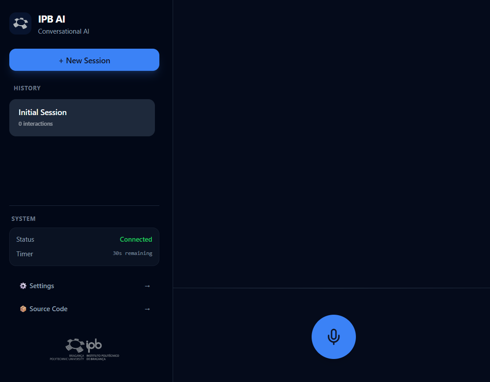

# IPB Conversational AI



A high-performance, native Windows conversational AI application built with **Tauri**, **React**, and a **Python Sidecar** pipeline. This project integrates cutting-edge AI services to provide a low-latency, voice-to-voice interaction experience.


## 🚀 Features

- **Real-time STT:** Powered by Deepgram Nova-2 with automatic language detection.
- **Advanced LLM:** Integrated with DeepSeek-V3 for intelligent, context-aware responses.
- **Natural TTS:** High-fidelity voice synthesis using ElevenLabs Multilingual v2.
- **Low Latency:** Binary WebSocket transport for raw 16kHz PCM audio streaming.
- **Modern UI:** Shadcn-inspired dark theme with glassmorphism and real-time audio visualization.
- **Session Management:** Support for multiple chat sessions with persistent history.
- **Safety Guardrails:** 30-second maximum recording timer with automatic AI acknowledgement.

## 🛠️ Architecture

The application uses a hybrid architecture:
1. **Frontend (React + Vite):** Handles the UI, microphone capture (Web Audio API), and sequential audio playback.
2. **Backend (Tauri/Rust):** Manages native windowing, secure API key storage, and sidecar process orchestration.
3. **Sidecar (Python):** A high-performance bridge that manages concurrent streams to Deepgram, DeepSeek, and ElevenLabs.

## 📦 Installation & Setup

### Prerequisites
- [Node.js](https://nodejs.org/) (v18+)
- [Rust](https://www.rust-lang.org/tools/install)
- [Python 3.10+](https://www.python.org/downloads/)
- API Keys for: Deepgram, SiliconFlow (DeepSeek), and ElevenLabs.

### Development
1. **Clone the repository:**
   ```bash
   git clone https://github.com/ricsrdocasro/IPB-APS-ConversationalAI.git
   cd IPB-APS-ConversationalAI
   ```

2. **Install Frontend dependencies:**
   ```bash
   npm install
   ```

3. **Setup Python Sidecar:**
   ```bash
   cd python-sidecar
   python -m venv venv
   source venv/bin/scripts/activate  # On Windows: .\venv\Scripts\activate
   pip install -r requirements.txt
   cd ..
   ```

4. **Run the application:**
   ```bash
   npm run tauri dev
   ```

## 🏗️ Building the Executable

To create a standalone Windows executable:

1. **Freeze the Python Sidecar:**
   Use PyInstaller to create a one-file binary of the sidecar:
   ```bash
   cd python-sidecar
   pyinstaller --onefile --name python-sidecar main.py
   ```
2. **Prepare Binaries:**
   Move and rename the resulting `.exe` to `src-tauri/binaries/python-sidecar-x86_64-pc-windows-msvc.exe`.

3. **Build Tauri App:**
   ```bash
   npm run tauri build
   ```

## 📄 License

This project was developed as part of the **Processamento de Sinal** course at the **Instituto Politécnico de Bragança (IPB)**.

---
Developed by [Ricardo Castro](https://github.com/ricsrdocasro) and Neyma Borges
